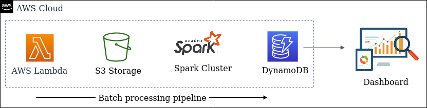

# Overview: Rust Github Insights.

This is a simple batch processing pipeline project. The dashbord shows statistics for various activities on the Github repositories belonging to the [Rust Language Project](https://github.com/rust-lang).
The raw data is obtained from the [Github's Activity API](https://docs.github.com/en/rest/reference/activity).

# Architecture

The pipeline starts with [extractor](extractor-function), An AWS Lambda function, fetching event data from Github's API and writing newline delimited JSON to a file on AWS S3. Then [processor](spark-processor), an Apache Spark application, reads the file on S3, aggregates the data and writes to an AWS DynamoDB table. [Dashboard](web-dashboard) is a Spring Boot application that provides a web UI and a REST API endpoint for accessing the processed data stored on DynamoDB.

The biggest improvement that can be made to this architecture is to automate the data pipeline using a workflow orchestration tool like Apache Airflow.

# Tech Stack

* Java 11
* Spring Boot - Used to serve the dashboard UI and provide a REST endpoint for data.
* Bulma - CSS library for styling the UI of the dashboard. 
* Apache Spark - For distributed batch processing of the raw data from Github's API.
* ChartJS - Used to create charts for visualizing the data.

* ## AWS Services

  - Lambda - Runs the extractor program that populates an S3 bucket with raw Github data.
  - S3 - Storage for raw Github data before the Spark job processes them.
  - DynamoDB - Persistence for the final output of the Spark job.
  - Elastic Beanstalk - Provides a way to conveniently deploy dashboard on EC2.
